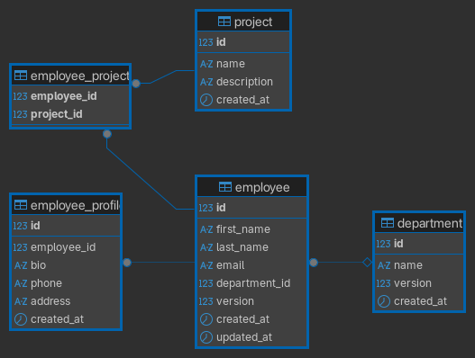

# Employee Management System – Backend

## Overview

This project is a **Spring Boot backend** for an Employee Management System.
It exposes REST APIs consumed by an Angular frontend and uses **PostgreSQL**.
The backend follows a layered architecture and a strict foreign-key–driven entity dependency strategy to ensure data integrity and maintainability.

---

## ADR Note

This README follows **Architecture Decision Record (ADR) principles**:

- **Context:** Backend entities require strict FK order and integrity.  
- **Decision:** Use Level 0–2 entity dependency hierarchy, DB as source of truth.  
- **Consequences:**  
  - Incremental development and testing possible  
  - Database enforces business rules  
  - PNG diagram serves as authoritative model  

---

## Technology Stack

- Java 25+
- Spring Boot 4+
- Spring Data JPA (Hibernate)
- PostgreSQL
- Gradle
- Virtual Threads (Project Loom)
- REST APIs
- Lombok (`@Getter`, `@Setter`, `@NoArgsConstructor`)

---

## API Architecture

The backend follows a **layered architecture** with clear separation of concerns:

### Layers
1. **Controller Layer** - REST endpoints, request/response handling
2. **Service Layer** - Business logic, transactions
3. **Repository Layer** - Data access
4. **Entity Layer** - JPA mappings

### DTO Pattern
All API operations use Data Transfer Objects (DTOs):
- **Request DTOs** (`*CreateRequest`, `*UpdateRequest`) - Input validation with Bean Validation
- **Response DTOs** (`*Response`) - Consistent API responses
- **Mapping** - MapStruct handles entity ↔ DTO conversion

### Example: Department API
```bash
# Create
POST /api/departments
Content-Type: application/json
{"name": "Engineering"}

# List All
GET /api/departments

# Get By ID
GET /api/departments/{id}

# Update
PUT /api/departments/{id}
Content-Type: application/json
{"name": "Engineering Updated"}

# Delete
DELETE /api/departments/{id}
```

**Status:** Department API fully implemented and tested.

## Layered Architecture - Deep Dive

### Layer Flow & Responsibilities
```
┌─────────────────────────────────────────────────────────────┐
│  HTTP Request (JSON)                                        │
└────────────────────────┬────────────────────────────────────┘
                         ▼
         ┌───────────────────────────────┐
         │   Controller Layer            │
         │  - Receives HTTP requests     │
         │  - Validates input (@Valid)   │
         │  - Returns HTTP responses     │
         └──────────┬────────────────────┘
                    ▼
         ┌───────────────────────────────┐
         │   Service Layer               │
         │  - Business logic             │
         │  - Transaction management     │
         │  - Orchestrates operations    │
         └──────────┬────────────────────┘
                    ▼
         ┌───────────────────────────────┐
         │   Repository Layer            │
         │  - Database operations        │
         │  - Query execution            │
         └──────────┬────────────────────┘
                    ▼
         ┌───────────────────────────────┐
         │   Database (PostgreSQL)       │
         └───────────────────────────────┘
```

### Data Flow Example: Creating a Project

**Request Flow (POST /api/projects):**

1. **Controller receives DTO:**
```json
   POST /api/projects
   {
     "name": "Cloud Migration",
     "description": "Migrate to AWS"
   }
```

2. **Controller validates & delegates:**
```java
   @PostMapping
   public ResponseEntity create(@Valid @RequestBody ProjectCreateRequest request) {
       ProjectResponse response = projectService.create(request);
       return ResponseEntity.status(HttpStatus.CREATED).body(response);
   }
```

3. **Service converts DTO → Entity:**
```java
   public ProjectResponse create(ProjectCreateRequest request) {
       Project project = projectMapper.toEntity(request);  // DTO → Entity
       Project saved = projectRepository.save(project);     // Save to DB
       return projectMapper.toResponse(saved);              // Entity → DTO
   }
```

4. **Mapper performs conversion:**
```java
   // MapStruct generates this automatically
   Project entity = new Project();
   entity.setName(request.getName());
   entity.setDescription(request.getDescription());
```

5. **Repository saves to database:**
```
   // Spring Data JPA executes:
   // INSERT INTO project (name, description, created_at) VALUES (?, ?, ?)
```

6. **Response DTO returned to client:**
```json
   HTTP 201 Created
   {
     "id": 1,
     "name": "Cloud Migration",
     "description": "Migrate to AWS",
     "createdAt": "2026-02-16T18:30:00-03:00"
   }
```

### DTO Strategy by HTTP Method

| HTTP Method | Request DTO | Response DTO | Purpose |
|------------|-------------|--------------|---------|
| **POST** | `*CreateRequest` | `*Response` | Create new resource |
| **GET** | None (path params) | `*Response` or `List<*Response>` | Retrieve resource(s) |
| **PUT** | `*UpdateRequest` | `*Response` | Update existing resource |
| **DELETE** | None (path params) | None (204 No Content) | Delete resource |

### Why Separate DTOs?

**Security & Control:**
- Clients cannot send `id` in CreateRequest (prevents overwriting)
- Clients cannot modify `createdAt` timestamp
- Server controls what data is exposed (no internal fields)

**Validation:**
- Different validation rules per operation
- Clear API contract: "What can I send vs. what will I receive?"

**Flexibility:**
- Entity structure can change without breaking API
- Support multiple API versions with different DTOs

### MapStruct Auto-Generation

MapStruct generates implementation at **compile time**:
```java
// You write:
@Mapper(componentModel = "spring")
public interface ProjectMapper {
    ProjectResponse toResponse(Project project);
}

// MapStruct generates:
@Component
public class ProjectMapperImpl implements ProjectMapper {
    public ProjectResponse toResponse(Project project) {
        ProjectResponse response = new ProjectResponse();
        response.setId(project.getId());
        response.setName(project.getName());
        response.setDescription(project.getDescription());
        response.setCreatedAt(project.getCreatedAt());
        return response;
    }
}
```

**Benefits:**
- No runtime reflection overhead
- Compile-time safety (errors caught early)
- Easy to customize with `@Mapping` annotations

## API Documentation

Interactive API documentation available via Swagger UI:

**Access:** http://localhost:8080/docs

**Features:**
- Test all endpoints directly in browser
- View request/response schemas
- See validation rules
- Try out authentication (when implemented)

**Current Endpoints:**
- `/api/departments` - Department CRUD operations
- `/api/projects` - Project CRUD operations

## Project Structure

```

br.com.techthordev.backend
├── entity
├── repository
├── service
├── controller
└── config

````

**Responsibilities:**

- **entity** – JPA mappings aligned with the database schema  
- **repository** – Spring Data JPA interfaces  
- **service** – Business logic & transaction handling  
- **controller** – REST endpoints  
- **config** – Security & infrastructure configuration  

---

## Database Schema (public)



The diagram is the **authoritative source of truth**:

- table definitions  
- foreign key relationships  
- dependency hierarchy  
- creation order  

Hibernate is configured:

```yaml
spring.jpa.hibernate.ddl-auto: validate
````

Ensures schema alignment and prevents divergence.

---

## Entity Dependency Strategy

Entities follow a **foreign-key–driven hierarchy**, grouped into dependency levels:

### Level 0 – Independent Tables

* No foreign keys
* Can be created and tested independently
* Examples: `Department`, `Project`

### Level 1 – Simply Dependent Tables

* Depend on exactly one Level 0 entity
* Example: `Employee` → `Department`

### Level 2 – Strongly Dependent Tables

* Depend on Level 1 or represent composed relationships
* Include One-to-One or Many-to-Many entities
* Examples: `EmployeeProfile` (1:1 → Employee), `EmployeeProject` (join table → Employee ↔ Project)

---

## Implementation Status

### Level 0 – Completed

* `Department`, `Project`
* Entities, Repositories, Integration Tests
* Validated against PostgreSQL (`ddl-auto: validate`)

### Level 1 – Completed

* `Employee`
* Dependency: FK `department_id` → `Department`
* DB constraint: `ON DELETE RESTRICT`
* Violations throw `DataIntegrityViolationException`

### Level 2 – Completed

* `EmployeeProfile`

    * One-to-One with Employee
    * Columns: `bio`, `phone`, `address`, `created_at`
* `EmployeeProject`

    * Join table between Employee ↔ Project
    * Composite PK via `EmployeeProjectId`
    * Ensures FK integrity and optional extension columns

**Note:** `EmployeeProjectId` is necessary to model the composite key for the join table. Without it, JPA cannot map `employee_id + project_id` as primary key.

---

## Repository Strategy

Repositories respect dependency levels:

* Level 0: `DepartmentRepository`, `ProjectRepository`
* Level 1: `EmployeeRepository`
* Level 2: `EmployeeProfileRepository`, `EmployeeProjectRepository`

Integration tests validate CRUD and FK constraints.

---

## Data Integrity Strategy

1. **Database Layer:** NOT NULL, FK, UNIQUE, CHECK
2. **JPA Layer:** `nullable=false`, `optional=false`, `@Version`
3. **Application Layer:** Bean Validation, service-level rules

Database constraints are the ultimate source of truth. Application validations improve UX only.

---

## Development Rules

* Follow dependency hierarchy strictly
* Keep schema diagram and database in sync
* Validate repositories after schema changes
* Test constraint violations explicitly

---

## Test Specification & Strategy

To ensure our architectural decisions (ADR) remain intact, we use a **Layered Integration Testing Strategy** (Level 0–2). These tests are not just unit checks; they are **Schema Validations** that ensure Java cannot bypass PostgreSQL's physical constraints.

### 1. Rationale: Why we test this way
* **Database as Authority:** We validate that JPA mappings perfectly align with PostgreSQL 18.2 via `hibernate.ddl-auto: validate`.
* **Constraint Enforcement:** We explicitly trigger and catch `DataIntegrityViolationException` to prove that `NOT NULL`, `FOREIGN KEY`, and `UNIQUE` constraints are active.
* **Documentation:** Tests are written as **Living Specifications** using `@DisplayName` to describe the business rules being enforced.

### 2. Test Hierarchy levels
| Level | Scope | Objectives | Failure Consequence |
| :--- | :--- | :--- | :--- |
| **0** | **Independent** | Verify tables (e.g., `Department`), Auditing, and `@Version` logic. | Total system instability. |
| **1** | **Simple Dep.** | Verify 1:N relations (e.g., `Employee` → `Dept`) and `ON DELETE RESTRICT`. | Risk of orphaned records and data leaks. |
| **2** | **Complex Rel.** | Verify 1:1 (`Profile`) and N:M (`Project`) via Composite Keys. | Corruption of business logic and reporting. |

### 3. Execution & Reporting
* **Environment:** Tests require the `test` profile to load the `.env` configuration for Podman.
* **IDE View:** In IntelliJ, the test tree provides a readable report (e.g., `CONSTRAINT CHECK: Must reject null FK`).
* **Command:** Run via CLI: `./gradlew clean test`.

### 4. Test Isolation & Data Cleanup

**Problem:** Spring's `@Transactional` rollback doesn't always clear test data when using `saveAndFlush()`, causing unique constraint violations in subsequent tests.

**Solution:** Explicit cleanup in `BaseDomainTest`:
```java
@BeforeEach
void setUp() {
    // Explicit cleanup before each test
    // Order matters due to Foreign Key constraints!
    employeeProjectRepository.deleteAll();
    employeeRepository.deleteAll();
    projectRepository.deleteAll();
    departmentRepository.deleteAll();
    
    // Force commit to database
    employeeProjectRepository.flush();
}
```

**Why this works:**
- `deleteAll()` marks entities for deletion
- `flush()` forces immediate execution of DELETE statements
- Deletion order respects FK constraints (children before parents)
- Each test starts with a clean slate

**Alternative considered:** UUID suffixes on test data were used initially but removed in favor of proper cleanup for more precise assertions.

## Next Steps

### Repository Layer (Completed ✅)
- All Level 0-2 entities implemented and tested
- FK constraints validated
- Test isolation strategy established

### Service Layer (Completed ✅)
- DepartmentService with full CRUD operations
- DTO pattern (CreateRequest, UpdateRequest, Response)
- MapStruct for entity/DTO mapping
- Transaction management with @Transactional
- Integration tests with BaseDomainTest

### Controller Layer (Completed ✅)
- DepartmentController with REST endpoints
- Bean Validation (@Valid) integration
- Proper HTTP status codes (201, 200, 204)
- Security disabled for development (permitAll)

### API Documentation (In Progress)
- Swagger/OpenAPI integration planned

### Remaining Implementation (Planned)
- Complete Service + Controller for: Project, Employee, EmployeeProfile, EmployeeProject
- Global Exception Handling (EntityNotFoundException, BusinessRuleException)
- Controller integration tests (optional)

### Security & Production Readiness (Future)
- Authentication & Authorization (JWT)
- CORS configuration for Angular frontend
- API rate limiting
- Logging & monitoring
- Production database migration strategy
